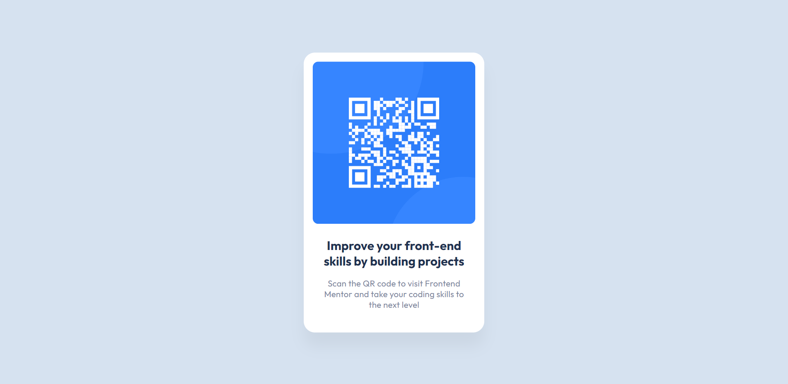

# Frontend Mentor - QR code component solution

This is a solution to the [QR code component challenge on Frontend Mentor](https://www.frontendmentor.io/challenges/qr-code-component-iux_sIO_H). Frontend Mentor challenges help you improve your coding skills by building realistic projects.

## Table of contents

- [Overview](#overview)
  - [Screenshot](#screenshot)
  - [Links](#links)
- [My process](#my-process)
  - [Built with](#built-with)
- [Author](#author)

## Overview

### Screenshot

### Links

- Solution URL: [https://github.com/pedrommb7/qr-code-app](https://github.com/pedrommb7/qr-code-app)
- Live Site URL: [https://fmqrcodeapp.netlify.app/](https://fmqrcodeapp.netlify.app/)

## My process

### Built with

- HTML
- SCSS, BEM
- Flexbox
- [React](https://react.dev/)

## Author

- Frontend Mentor - [@pedrommb7](https://www.frontendmentor.io/profile/pedrommb7)
